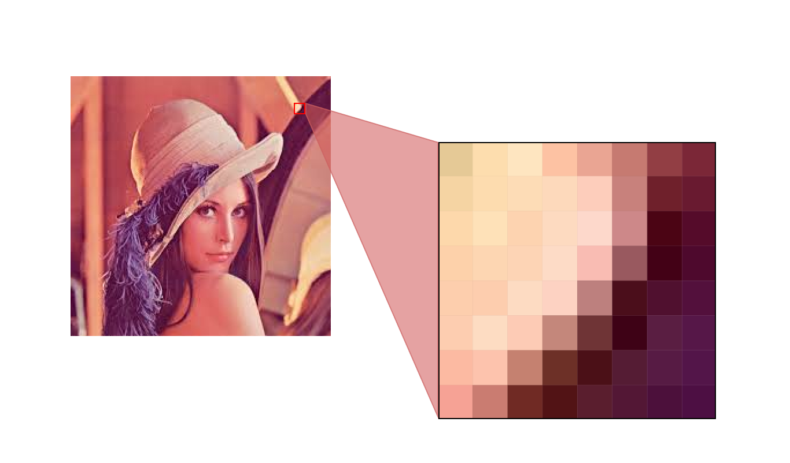
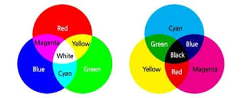
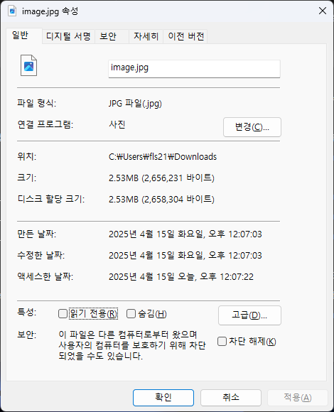
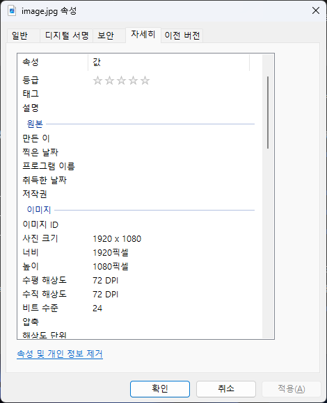
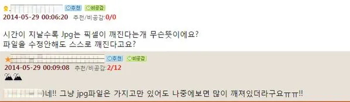
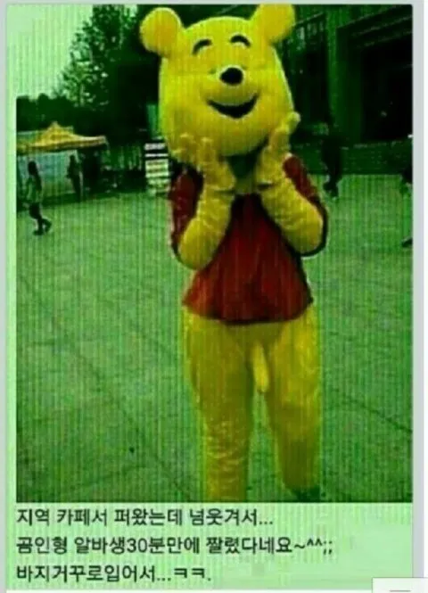
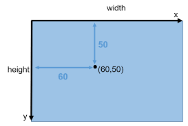

# 5주차

---

### Image

---

### Image

###### <span style="color:rgb(130, 151, 161)">🏷️ Determination</span>

<hr/>

- 2차원 배열 형태의 데이터로, 각 pixel이 특정한 값 `RGB(3) 또는 grayscale(1)` 을 가짐

- 보통은 사진, 프레임, 영상 등에서 얻어진 **정적인** 이미지를 지칭

- 컬러 이미지의 경우 (height, width, channels) 형태의 3차원 배열로 표현됨

---

### Image

###### <span style="color:rgb(130, 151, 161)">🏷️ Computer Vision & Computer Graphics & Image Processing</span>

<hr/>


---

### Image

###### <span style="color:rgb(130, 151, 161)">🏷️ Category</span>

<hr/>

- `Computer Vision` : Image to Data

- `Computer Graphics` : Data to Image

- `Image Processing` : Image to Image

---

### Image

###### <span style="color:rgb(130, 151, 161)">🏷️ How to compose iamge(1)</span>

<hr/>



---

### Image

###### <span style="color:rgb(130, 151, 161)">🏷️ How to compose iamge(2)</span>

<hr/>

###### ✅ 어떤 영상이 나올까?

<style scoped>
code {
  font-size: 10px;
}
</style>

```py
import numpy as np
from PIL import Image
import matplotlib.pyplot as plt

img_array = np.array([
    [2, 2, 7, 17, 22, 23, 18, 26, 40, 49, 55, 61, 66, 69, 70, 65],
    [5, 10, 27, 40, 67, 103, 150, 171, 163, 154, 135, 114, 104, 80, 81, 79],
    [37, 47, 67, 130, 180, 161, 151, 148, 135, 135, 136, 147, 170, 142, 105, 92],
    [84, 96, 147, 151, 133, 149, 140, 129, 120, 132, 142, 134, 119, 123, 137, 119],
    [115, 135, 109, 93, 131, 146, 119, 110, 106, 115, 130, 131, 100, 86, 88, 108],
    [136, 115, 95, 81, 132, 131, 108, 98, 97, 107, 117, 131, 103, 76, 81, 99],
    [147, 120, 104, 92, 138, 109, 91, 108, 107, 97, 70, 118, 102, 60, 90, 124],
    [151, 158, 123, 144, 127, 65, 81, 133, 132, 103, 47, 97, 97, 103, 102, 145],
    [150, 156, 154, 171, 160, 143, 138, 148, 141, 135, 131, 123, 109, 145, 161, 146],
    [150, 156, 161, 171, 178, 150, 145, 133, 117, 129, 123, 122, 111, 161, 182, 148],
    [150, 156, 161, 169, 185, 165, 139, 75, 76, 118, 125, 117, 121, 158, 184, 150],
    [147, 154, 159, 162, 163, 167, 147, 34, 15, 111, 127, 105, 107, 152, 187, 155],
    [144, 148, 154, 158, 179, 172, 137, 82, 57, 74, 102, 74, 99, 150, 166, 165],
    [135, 141, 146, 150, 179, 156, 115, 115, 80, 90, 74, 84, 108, 132, 150, 151],
    [129, 133, 138, 148, 178, 135, 112, 114, 109, 102, 99, 100, 119, 130, 128, 134],
    [124, 126, 129, 146, 163, 120, 109, 111, 112, 107, 101, 110, 114, 117, 119, 125]
], dtype=np.uint8)

plt.imshow(img_array, cmap='gray')
plt.axis('off')
plt.show()
```

---

### Image

###### <span style="color:rgb(130, 151, 161)">🏷️ How to compose iamge(3)</span>

<hr/>

###### ✅ 어떤 영상이 나올까?

```py
import numpy as np
import matplotlib.pyplot as plt

img_array = np.array([
    [[1, 3, 0], [2, 3, 1], [4, 10, 2], [6, 26, 3], [9, 32, 3], [10, 33, 3], [10, 26, 2], [18, 34, 3], [32, 51, 5], [41, 61, 4], [46, 69, 3], [52, 77, 2], [56, 83, 4], [59, 87, 6], [58, 88, 7], [51, 84, 4]],
    [[3, 6, 2], [4, 15, 2], [9, 41, 3], [23, 56, 2], [60, 80, 15], [112, 111, 40], [182, 149, 72], [214, 165, 85], [208, 156, 82], [194, 149, 76], [165, 134, 59], [129, 120, 41], [111, 114, 32], [70, 99, 11], [67, 102, 10], [65, 99, 9]],
    [[18, 53, 2], [27, 65, 3], [52, 87, 6], [144, 138, 50], [224, 176, 83], [211, 153, 74], [197, 143, 70], [192, 141, 70], [178, 129, 57], [181, 128, 52], [182, 129, 53], [196, 140, 52], [224, 162, 71], [173, 142, 57], [102, 120, 33], [78, 113, 18]],
    [[70, 105, 11], [85, 115, 23], [175, 149, 63], [197, 145, 63], [174, 128, 51], [195, 142, 64], [188, 133, 53], [174, 122, 43], [165, 114, 37], [178, 125, 44], [187, 135, 56], [177, 129, 49], [158, 115, 39], [169, 117, 36], [178, 132, 54], [124, 131, 43]],
    [[100, 139, 33], [156, 139, 59], [143, 106, 38], [123, 91, 28], [172, 126, 53], [189, 141, 62], [162, 114, 34], [154, 104, 22], [149, 101, 20], [156, 110, 30], [171, 126, 47], [170, 127, 52], [132, 97, 30], [111, 85, 27], [116, 87, 24], [118, 117, 37]],
    [[120, 162, 46], [135, 119, 41], [121, 94, 32], [112, 77, 23], [172, 128, 52], [177, 125, 45], [153, 102, 19], [140, 93, 14], [139, 92, 13], [152, 102, 19], [159, 112, 33], [168, 127, 54], [134, 101, 33], [100, 74, 24], [100, 81, 28], [106, 108, 32]],
    [[130, 174, 51], [132, 128, 44], [130, 102, 44], [127, 89, 16], [177, 134, 57], [143, 104, 42], [129, 86, 18], [154, 102, 18], [152, 101, 20], [137, 93, 16], [92, 66, 29], [149, 115, 50], [128, 102, 36], [83, 57, 11], [106, 92, 42], [118, 143, 41]],
    [[135, 178, 53], [160, 175, 62], [148, 125, 50], [176, 146, 50], [167, 123, 39], [85, 62, 28], [110, 76, 31], [179, 126, 51], [177, 125, 51], [138, 99, 36], [59, 46, 24], [125, 95, 34], [121, 98, 30], [130, 103, 35], [116, 108, 35], [131, 171, 44]],
    [[136, 177, 51], [142, 184, 52], [149, 176, 51], [189, 183, 66], [208, 154, 62], [189, 137, 54], [182, 131, 57], [191, 141, 72], [183, 135, 66], [175, 129, 58], [166, 127, 60], [155, 121, 49], [131, 111, 40], [178, 144, 65], [158, 181, 64], [132, 173, 46]],
    [[136, 177, 50], [142, 184, 51], [147, 189, 51], [176, 190, 63], [229, 172, 74], [200, 143, 55], [193, 137, 60], [169, 128, 60], [152, 113, 46], [171, 123, 49], [155, 120, 51], [150, 122, 51], [134, 113, 41], [200, 157, 78], [201, 190, 90], [136, 172, 52]],
    [[136, 176, 51], [141, 183, 52], [146, 190, 51], [166, 192, 61], [229, 182, 86], [213, 160, 69], [183, 133, 52], [83, 76, 48], [80, 77, 56], [153, 115, 44], [159, 122, 51], [139, 119, 52], [147, 122, 52], [198, 154, 74], [221, 183, 90], [143, 172, 59]],
    [[133, 173, 47], [140, 182, 47], [145, 187, 49], [152, 188, 53], [188, 168, 68], [211, 162, 73], [186, 143, 64], [44, 34, 11], [20, 14, 5], [138, 110, 44], [157, 126, 55], [126, 107, 40], [134, 107, 35], [194, 148, 66], [231, 182, 94], [161, 169, 69]],
    [[129, 171, 42], [134, 176, 43], [141, 181, 49], [147, 183, 54], [202, 185, 84], [215, 168, 76], [173, 134, 54], [106, 79, 32], [85, 51, 18], [94, 74, 22], [126, 103, 36], [97, 75, 12], [128, 99, 24], [184, 148, 73], [203, 163, 85], [190, 168, 84]],
    [[121, 161, 40], [126, 167, 44], [132, 172, 49], [137, 176, 54], [209, 182, 87], [199, 151, 66], [152, 113, 28], [144, 115, 40], [100, 82, 21], [113, 93, 18], [99, 75, 7], [112, 84, 10], [135, 109, 35], [158, 132, 62], [176, 149, 83], [177, 152, 82]],
    [[115, 153, 42], [119, 158, 43], [123, 163, 46], [140, 170, 54], [219, 175, 88], [174, 132, 51], [148, 111, 27], [146, 113, 31], [137, 110, 27], [129, 103, 22], [127, 101, 16], [127, 100, 25], [144, 119, 51], [154, 130, 68], [150, 129, 66], [157, 135, 72]],
    [[110, 147, 43], [112, 149, 41], [115, 154, 37], [146, 163, 56], [202, 159, 77], [154, 118, 38], [142, 108, 30], [145, 109, 32], [140, 112, 38], [135, 108, 32], [131, 101, 22], [136, 111, 40], [139, 114, 48], [140, 117, 53], [141, 120, 56], [142, 127, 68]]
], dtype=np.uint8)

plt.imshow(img_array)
plt.axis('off')
plt.show()
```

---

### Image

###### <span style="color:rgb(130, 151, 161)">🏷️ channel</span>

<hr/>

- **⚫ 1채널 이미지** : 흑백 또는 그레이스케일 이미지. 하나의 채널에 밝기(intensity) 정보만 있음.

- **🖼️ 3채널 이미지** : <span style="background:rgb(229, 255, 0)">보통</span> RGB(Red, Green, Blue) 3가지 색상의 정보를 각각 하나의 채널에 담고 있는 이미지.

---

### Image

###### <span style="color:rgb(130, 151, 161)">🏷️ primary colors</span>

<hr/>

- **빛의 3원색** : 빛의 기본 색으로, 화면이나 조명에서 사용된다.

- **색의 3원색** : 인쇄나 그림 물감 등에서 사용하는 색의 기본.

---

### Image

###### <span style="color:rgb(130, 151, 161)">🏷️ primary colors</span>

<hr/>



---

### Image

###### <span style="color:rgb(130, 151, 161)">🏷️ RGB 24bit color space</span>

<hr/>

디지털 이미지에서 기본적으로 색을 표현하기 위해 가장 널리 사용되는 방식은 RGB 24비트(RGB 24bit) 색상 공간.

- **Red (빨강)**: 8비트 (0~255)

- **Green (초록)**: 8비트 (0~255)

- **Blue (파랑)**: 8비트 (0~255)

표현 가능한 색상 수: `256` × `256` × `256` = `16,777,216`가지 색상

---

### Image

###### <span style="color:rgb(130, 151, 161)">🏷️ RGB 24bit color space</span>

<hr/>

<div style="background:rgb(130, 151, 161);font-size:20px;padding-left:10px;padding-top:10px;padding-bottom:10px">130, 151, 161</div>

🎇 rgb(130, 151, 161) 에 대하여

24bit: 10000010 10010111 10100001

| 색상 채널 | 10진수 값 | 8bit 이진수 표현 | 16진수 표현 |
| --------- | --------- | ---------------- | ----------- |
| Red (R)   | 130       | 10000010         | 82          |
| Green (G) | 151       | 10010111         | 97          |
| Blue (B)  | 161       | 10100001         | A1          |

이에 따른 hex 색상 표현 : `#8297A1`

---

### Image

###### <span style="color:rgb(130, 151, 161)">🏷️ size</span>

<hr/>

| 이름            | 해상도 (픽셀) | 비율  | 설명                                 |
| --------------- | ------------- | ----- | ------------------------------------ |
| Thumbnail       | 150 x 150     | 1:1   | 웹 미리보기, 프로필 사진 등          |
| Small           | 640 x 480     | 4:3   | 웹용 작은 이미지, 블로그 사진        |
| HD (720p)       | 1280 x 720    | 16:9  | 기본 고화질 영상                     |
| FHD (1080p)     | 1920 x 1080   | 16:9  | 일반 모니터, YouTube 표준 해상도     |
| QHD (1440p)     | 2560 x 1440   | 16:9  | 고급형 모니터, 게이밍 환경 등        |
| 2K              | 2048 x 1080   | ~17:9 | 디지털 영화관용 표준                 |
| 4K UHD          | 3840 x 2160   | 16:9  | 초고화질 TV 및 영상 콘텐츠           |
| 8K UHD          | 7680 x 4320   | 16:9  | 초고해상도 콘텐츠 및 미래지향적 사용 |
| Instagram Post  | 1080 x 1080   | 1:1   | 인스타그램 정사각형 이미지           |
| Instagram Story | 1080 x 1920   | 9:16  | 인스타그램 스토리/릴스 용도          |

---

### Image

###### <span style="color:rgb(130, 151, 161)">🏷️ size</span>

<hr/>

###### 일반적인 youtube FHD 이미지 기준

- **해상도** : `1920` x `1080` = `2,073,600` 픽셀

- **각 픽셀** : RGB(24) = 3Byte

$2,073,600 px × 3 bytes=6,220,800 bytes≈5.93 MB$

---

### Image

###### <span style="color:rgb(130, 151, 161)">🏷️ encoding</span>

<hr/>

| size                           | resolution                     |
| ------------------------------ | ------------------------------ |
|  |  |

`어떻게?`

---

### Image

###### <span style="color:rgb(130, 151, 161)">🏷️ encoding</span>

<hr/>

| 포맷                                                  | 압축 방식        | 투명도 지원 | 애니메이션 지원 | 주요 특징 및 용도                                    |
| ----------------------------------------------------- | ---------------- | ----------- | --------------- | ---------------------------------------------------- |
| <span style="background:rgb(229, 255, 0)">JPEG</span> | 손실 압축        | ❌ 불가     | ❌ 불가         | 사진, 풍부한 색조 표현에 적합. 용량이 작고 빠름.     |
| PNG                                                   | 무손실 압축      | ✅ 가능     | ❌ 불가         | 투명 배경이 필요한 UI, 아이콘, 그래픽 등. 품질 유지. |
| WebP                                                  | 손실/무손실 모두 | ✅ 가능     | ✅ 가능         | 최신 웹용 이미지. JPEG보다 작고, PNG보다 유연함.     |

---

### Image

###### <span style="color:rgb(130, 151, 161)">🏷️ JPEG</span>

<hr/>

##### ✅ 기본 개념

- 손실 압축 방식을 사용하는 이미지 포맷

- 파일 확장자는 보통 `.jpg` 또는 `.jpeg`

---

### Image

###### <span style="color:rgb(130, 151, 161)">🏷️ JPEG</span>

<hr/>

##### ⚙️ 압축 과정 요약

1. **색상 공간 변환**

- RGB → YCbCr (밝기(Y) + 색차(Cb, Cr))로 변환

- 사람 눈은 색보다 밝기에 민감하므로 색차 정보는 더 많이 압축 가능

- YCbCr의 비트 수는 픽셀당 12, 16 또는 24비트로 표현될 수 있으며, 이는 샘플링 방식(4:4:4, 4:2:2, 4:2:0 등)에 따라 다름

---

### Image

###### <span style="color:rgb(130, 151, 161)">🏷️ JPEG</span>

<hr/>

2. **샘플링 (Chroma Subsampling)**

- 색차(Cb, Cr) 채널의 해상도를 줄여 데이터 양을 감소 (예: 4:2:0)

3. **DCT (이산 코사인 변환)**

- 8x8 블록 단위로 주파수 성분으로 변환 (이미지를 주파수로 바꿈)

---

### Image

###### <span style="color:rgb(130, 151, 161)">🏷️ JPEG</span>

<hr/>

4. **양자화 (Quantization)**

- 사람 눈이 덜 민감한 고주파 성분은 과감히 제거 → <span style="background:rgb(229, 255, 0)">손실 압축</span> 발생

5. **허프만 부호화 (Huffman Coding)**

- 최종적으로 빈도 기반 압축을 통해 파일 크기 최소화

---

### Image

###### <span style="color:rgb(130, 151, 161)">🏷️ JPEG</span>

<hr/>

### 🖼️ 디지털 풍화?



---

### Image

###### <span style="color:rgb(130, 151, 161)">🏷️ JPEG</span>

<hr/>



---

# Open CV

---

### Open CV

###### <span style="color:rgb(130, 151, 161)">🏷️ python install</span>

<hr/>

```sh
pip install opencv-python
```

---

### Open CV

###### <span style="color:rgb(130, 151, 161)">🏷️ Getting Started with Images</span>

<hr/>

<style scoped>
code {
  font-size: 20px;
}
</style>

```py
import cv2 as cv
import sys

img = cv.imread(cv.samples.findFile("lena.jpg"))

if img is None:
    sys.exit("Could not read the img/imag.")

cv.imshow("Display window", img)
k = cv.waitKey(0)

if k == ord("s"):
    cv.imwrite("output.png", img)
```

---

### Open CV

###### <span style="color:rgb(130, 151, 161)">🏷️ Drawing Functions in OpenCV</span>

<hr/>

- 다양한 기하 도형을 OpenCV로 그리는 방법을 학습

- 주요 함수: `cv.line()`, `cv.circle()`, `cv.rectangle()`, `cv.ellipse()`, `cv.putText()`

##### 📚 공통 인자

| 인자명    | 설명                                                     |
| --------- | -------------------------------------------------------- |
| img       | 그림을 그릴 대상 이미지                                  |
| color     | 도형 색상 (예: BGR (255,0,0) = 파랑)                     |
| thickness | 선의 두께 (닫힌 도형에서 -1은 내부 채움)                 |
| lineType  | 선의 스타일 (일반: 8-connected, 부드러운 선: cv.LINE_AA) |

---

### Open CV

###### <span style="color:rgb(130, 151, 161)">🏷️ Drawing Functions in OpenCV</span>

<hr/>

##### 🖊️ Drawing a Line

```py
# Create a black image
img = np.zeros((512,512,3), np.uint8)

# Draw a diagonal blue line with thickness of 5 px
cv.line(img, (0, 0), (511, 511), (255, 0, 0), 5)
```

---

### Open CV

###### <span style="color:rgb(130, 151, 161)">🏷️ Drawing Functions in OpenCV</span>

<hr/>

##### 🟩 Drawing a Rectangle

```py
# Draw a green rectangle at the top-right
cv.rectangle(img, (384, 0), (510, 128), (0, 255, 0), 3)
```

---

### Open CV

###### <span style="color:rgb(130, 151, 161)">🏷️ Drawing Functions in OpenCV</span>

<hr/>

##### 🔴 Drawing a Circle

```py
# Draw a filled red circle inside the rectangle
cv.circle(img, (447, 63), 63, (0, 0, 255), -1)
```

---

### Open CV

###### <span style="color:rgb(130, 151, 161)">🏷️ Drawing Functions in OpenCV</span>

<hr/>

##### 🥚 Drawing an Ellipse

```py
# Draw a half ellipse at center
cv.ellipse(img, (256, 256), (100, 50), 0, 0, 180, 255, -1)
```

---

### Open CV

###### <span style="color:rgb(130, 151, 161)">🏷️ Drawing Functions in OpenCV</span>

<hr/>

##### 🔷 Drawing a Polygon

```py
pts = np.array([[10,5],[20,30],[70,20],[50,10]], np.int32)
pts = pts.reshape((-1, 1, 2))

# Draw yellow polygon
cv.polylines(img, [pts], True, (0, 255, 255))
```

💡 `True`이면 닫힌 도형, `False`이면 열린 도형.

---

### Open CV

###### <span style="color:rgb(130, 151, 161)">🏷️ Drawing Functions in OpenCV</span>

<hr/>

##### 🔠 Adding Text to Image

```py
font = cv.FONT_HERSHEY_SIMPLEX
cv.putText(img, 'OpenCV', (10, 500), font, 4, (255,255,255), 2, cv.LINE_AA)
```

---

### Open CV

###### <span style="color:rgb(130, 151, 161)">🏷️ Drawing Functions in OpenCV</span>

<hr/>

##### 📷 Whole Code

<style scoped>
code {
  font-size: 8px;
}
</style>

```py
import numpy as np
import cv2 as cv

# Create a black image
img = np.zeros((512,512,3), np.uint8)

# 🖊️ Draw a diagonal blue line with thickness of 5 px
cv.line(img, (0, 0), (511, 511), (255, 0, 0), 5)

# 🟩 Draw a green rectangle at the top-right
cv.rectangle(img, (384, 0), (510, 128), (0, 255, 0), 3)

# 🔴 Draw a filled red circle inside the rectangle
cv.circle(img, (447, 63), 63, (0, 0, 255), -1)

# 🥚 Draw a half ellipse at center
cv.ellipse(img, (256, 256), (100, 50), 0, 0, 180, 255, -1)

# 🔷 Draw a yellow polygon
pts = np.array([[10,5],[20,30],[70,20],[50,10]], np.int32)
pts = pts.reshape((-1, 1, 2))
cv.polylines(img, [pts], True, (0, 255, 255))

# 🔠 Add white text
font = cv.FONT_HERSHEY_SIMPLEX
cv.putText(img, 'OpenCV', (10, 500), font, 4, (255,255,255), 2, cv.LINE_AA)

# 🖼️ Show the image
cv.imshow("Drawing Output", img)
cv.waitKey(0)
cv.destroyAllWindows()
```

---

### Open CV

###### <span style="color:rgb(130, 151, 161)">🏷️ Mouse as a Paint-Brush</span>

<hr/>

- OpenCV에서 마우스 이벤트 처리

- 사용할 주요 함수: `cv.setMouseCallback()`

##### 🖱️ Sample

더블 클릭한 위치에 원을 그리는 간단한 애플리케이션 코드

1. 마우스 이벤트가 발생했을 때 실행되는 **마우스 콜백 함수**를 정의.

2. 마우스 이벤트는 왼쪽 버튼 클릭, 더블 클릭 등 마우스와 관련된 다양한 동작 핸들링 가능.

3. MouseCallback 함수는 이벤트 발생 위치의 `(x, y)` 좌표를 전달받으며 이에 따른 핸들링 가능.

---

### Open CV

###### <span style="color:rgb(130, 151, 161)">🏷️ Mouse as a Paint-Brush</span>

<hr/>

##### ✨ Event List 확인

```py
import cv2 as cv
events = [i for i in dir(cv) if 'EVENT' in i]
print(events)
```

---

### Open CV

###### <span style="color:rgb(130, 151, 161)">🏷️ Mouse as a Paint-Brush</span>

<hr/>

##### Sample Code

다음 코드를 작성하고 실행하여 어떤 동작을 하는지 판단해보자

<style scoped>code{font-size:14px}</style>

```py
import numpy as np
import cv2 as cv

def draw_circle(event,x,y,flags,param):
    if event == cv.EVENT_LBUTTONDBLCLK:
        cv.circle(img,(x,y),100,(255,0,0),-1)

img = np.zeros((512,512,3), np.uint8)
cv.namedWindow('image')
cv.setMouseCallback('image',draw_circle)

while(1):
    cv.imshow('image',img)
    if cv.waitKey(20) & 0xFF == 27:
        break
cv.destroyAllWindows()
```

---

### Open CV

###### <span style="color:rgb(130, 151, 161)">🏷️ Mouse as a Paint-Brush</span>

<hr/>

##### Advanced Code

다음 코드를 작성하고 실행하여 어떤 동작을 하는지 판단해보자

<style scoped>code{font-size:9px}</style>

```py
import numpy as np
import cv2 as cv

drawing = False # true if mouse is pressed
mode = True # if True, draw rectangle. Press 'm' to toggle to curve
ix,iy = -1,-1

# mouse callback function
def draw_circle(event,x,y,flags,param):
    global ix,iy,drawing,mode

    if event == cv.EVENT_LBUTTONDOWN:
        drawing = True
        ix,iy = x,y

    elif event == cv.EVENT_MOUSEMOVE:
        if drawing == True:
            if mode == True:
                cv.rectangle(img,(ix,iy),(x,y),(0,255,0),-1)
            else:
                cv.circle(img,(x,y),5,(0,0,255),-1)

    elif event == cv.EVENT_LBUTTONUP:
        drawing = False
        if mode == True:
            cv.rectangle(img,(ix,iy),(x,y),(0,255,0),-1)
        else:
            cv.circle(img,(x,y),5,(0,0,255),-1)
```

---

### Open CV

###### <span style="color:rgb(130, 151, 161)">🏷️ Mouse as a Paint-Brush</span>

<hr/>

<style scoped>code{font-size:14px}</style>

```py
img = np.zeros((512,512,3), np.uint8)
cv.namedWindow('image')
cv.setMouseCallback('image',draw_circle)

while(1):
cv.imshow('image',img)
k = cv.waitKey(1) & 0xFF
if k == ord('m'):
mode = not mode
elif k == 27:
break

cv.destroyAllWindows()
```

---

### Open CV

###### <span style="color:rgb(130, 151, 161)">🏷️ Trackbar as the Color Palette</span>

<hr/>

- OpenCV 윈도우에 트랙바를 바인딩.

- 관련 함수: `cv.getTrackbarPos()`, `cv.createTrackbar()`

---

### Open CV

###### <span style="color:rgb(130, 151, 161)">🏷️ Trackbar as the Color Palette</span>

<hr/>

##### Sample Code

다음 코드를 작성하고 실행하여 어떤 동작을 하는지 판단해보자

<style scoped>code{font-size:12px}</style>

```py
import numpy as np
import cv2 as cv

def nothing(x):
    pass

# Create a black image, a window
img = np.zeros((300,512,3), np.uint8)
cv.namedWindow('image')

# create trackbars for color change
cv.createTrackbar('R','image',0,255,nothing)

cv.createTrackbar('G','image',0,255,nothing)
cv.createTrackbar('B','image',0,255,nothing)

# create switch for ON/OFF functionality
switch = '0 : OFF \n1 : ON'
cv.createTrackbar(switch, 'image',0,1,nothing)
```

---

### Open CV

###### <span style="color:rgb(130, 151, 161)">🏷️ Trackbar as the Color Palette</span>

<hr/>

<style scoped>code{font-size:14px}</style>

```py
while(1):
    cv.imshow('image',img)
    k = cv.waitKey(1) & 0xFF
    if k == 27:
        break

    # get current positions of four trackbars
    r = cv.getTrackbarPos('R','image')
    g = cv.getTrackbarPos('G','image')
    b = cv.getTrackbarPos('B','image')
    s = cv.getTrackbarPos(switch,'image')

    if s == 0:
        img[:] = 0
    else:
        img[:] = [b,g,r]

cv.destroyAllWindows()
```

---

### 실습

<hr/>

✅ 영상의 좌표계



---

### 실습

###### <span style="color:rgb(130, 151, 161)">🏷️ 국기 그리기</span>

<hr/>

영상 좌표계에 대한 이해를 바탕으로 국기를 그려본다. 예를들어 다음과 같이 코드를 작성하면 프랑스 국기를 그릴 수 있다.

<style scoped>code{font-size:12px}</style>

```py
import cv2
import numpy as np

width = 512
height = 512
img = np.ones((height, width, 3), dtype=np.uint8) * 255

blue = (255, 0, 0)
white = (255, 255, 255)
red = (0, 0, 255)

cv2.rectangle(img, (0, 0), (width // 3, height), red, -1)
cv2.rectangle(img, (width // 3, 0), (width * 2 // 3, height), white, -1)
cv2.rectangle(img, (width * 2 // 3, 0), (width, height), blue, -1)

cv2.imshow("image", img)

cv2.waitKey(0)
cv2.destroyAllWindows()
```

---

### 실습

###### <span style="color:rgb(130, 151, 161)">🏷️ 국기 그리기</span>

<hr/>

- **난이도 쉬움** : 프랑스, 독일, 이탈리아, 일본

- **난이도 중간** : 한국, 영국

- **난이도 어려움** : 미국, 캐나다, 사우디아라비아

---

### 실습

###### <span style="color:rgb(130, 151, 161)">🏷️ 그림판</span>

<hr/>

`MouseCallback`과 `trackbar`를 사용하여 그림판에 펜으로 그림을 그릴 수 있는 그림판을 만들어보자
